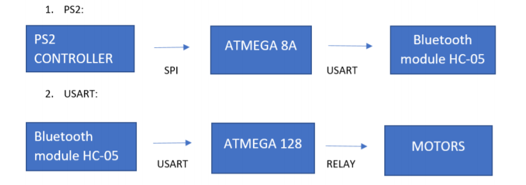

# Wireless-Driving-Shield
Prepare universal wireless shield for remote robot driving.  

As shown in the above figure, PS2 Contoller sends command signals to Atmega 8A using SPI protocol. Atmega 8A is connected wirelessly to Atmega128 via Bluetooth HC-05 and uses USART protocol for communication. Atmega128 actuates the motors using relays on basis of commands received wirelessly from Atmega8.

This was achieved in 2 parts:  
* Interfacing the PS2 controller with our microcontroller. This code can be found in the PS2 Interfacing directory.  
* Communication between the bluetooth modules and actuating the motors accordingly. This code is given in the Communication  directory.  

